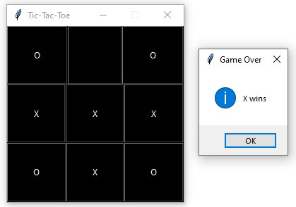

# Tic-Tac-Toe
* This is a Tic-Tac-Toe game made using Python Graphical User Interface(GUI).
* This is made for educational purpose.

# Tech Stack
* Python (GUI)
# Images

# Contributing
Any kind of contributions are welcome.

1. Fork the repo on GitHub.
2. Clone the project to your own machine.
3. Commit changes to development branch.
4. Push your work back up to your fork.
5. Submit a Pull request so that I can review your changes
 THANKS FOR VISITING -Vikas

